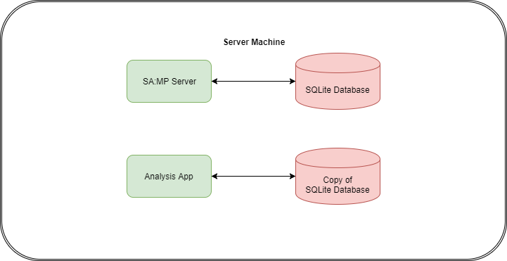
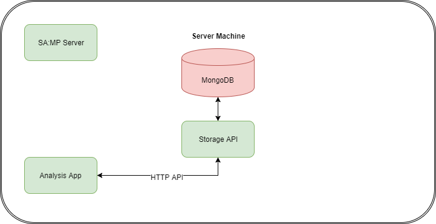
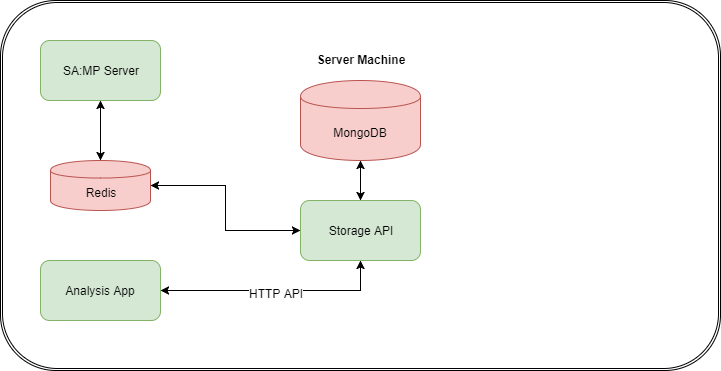

# Scavenge and Survive

This document covers how the
[Scavenge and Survive](https://github.com/Southclawss/ScavengeSurvive) gamemode
uses Redis to handle a communication channel to a storage API which will later
be expanded into a fully fledged multi-server database and webapp ecosystem.

## Part 1: Changing Databases

Originally, Scavenge and Survive (SS) stored user accounts in an SQLite database
and user character data in [Modio](https://github.com/Southclawss/modio) encoded
files.

This worked well for a while but I wanted easier access to that data in a more
modern, document-oriented format. I also wanted to be able to do certain complex
queries and analysis on the data outside of Pawn-space and this involved copying
the database to be queried elsewhere.



I'm also not a huge fan of SQL, especially in Pawn. I'd rather deal with my
database model in a language such as Go, Python or JavaScript.

So, what's what I did.

I wrote an app that handled all the possible operations on all the possible
datasets and provided that functionality as a HTTP RESTful JSON API (damn that
was a lot of acronyms!)

### HTTP REST JSON API???

Quick tangent for those unfamiliar with some/all of these terms. If you are,
just skip to **"Integrating Redis"**...

* HTTP: this is likely how you're reading this (with the added security of
  HTTPS - but I won't get into that). HTTP is a protocol primarily for sending
  text data between applications. Right now, GitHub is serving you HTML files
  via HTTP. But it's now a common way for purely server-side applications to
  interact too. It supports a bunch of "methods" such as `GET` (get data),
  `POST` (set data) and more.
* RESTful: this one is a bit of an awkward term as there's no _real_
  classification of what qualifies as *REST*ful - it's basically a set of
  standard guidelines for how HTTP applications should interact. You don't
  really have to worry about it but I added it here so you can go off and learn
  more if you want to.
* JSON: JavaScript Object Notation: `{"name": "Southclawss",
  "favourite_language": "Go"}` a nice way of representing structure data in
  text, pretty much the language of most APIs on the web.
* API: Application Programming Interface. `GetPlayerHealth` is part of the SA:MP
  API. It's a way of applications providing a pre-set collection of instructions
  to interact with it.

So what do we get when we smash all these letters together?

An application that runs on the internet, you can send instructions to it via
HTTP. Say for example, I built an app with the following two URLs:

* `http://my-game-server.com/api/SetPlayerHealth`
* `http://my-game-server.com/api/GetPlayerHealth`

I could submit a "HTTP POST request" to the first one containing the JSON data:
`{"playerid": 0, "health": 45.0}` and that would be the web version of calling
`SetPlayerHealth(playerid, 45.0)` Similarly, I could submit a "HTTP GET request"
to the second one containing the JSON data `{"playerid": 0}` and it would return
`{"health": 45.0}`

So hopefully you now have a basic idea of what all those letters mean. The
storage server of SS works just like this but with a lot more routes to get and
set various player account data.

Back to the juicy bits...

---

## Integrating Redis

Because I'm now not using Pawn to handle storage, I have plenty of options for
what database to use instead of SQLite. I chose MongoDB mainly because I work
with it already so I'm familiar with its capabilities. It fits the use-case
quite well too. At this point, SS now looks like this:



But now our SA:MP server is lonely, it has no way to talk to the database
because it's MongoDB and I suck at C++ so I'm definitely not writing a MongoDB
plugin for SA:MP!

This is where Redis comes in - the primary reason I built it!

The Redis plugin isn't just a key-value store, it's also a way of triggering
events. Say for example, a player joins the server - that's an event. It's a
thing that happened in time and we need a way of getting their data out of
MongoDB and into Pawn-space.



(I've drawn Redis here as a database but it's also a basic event system for
notifying other applications)

So now the Storage API application is listening to Redis for events from the SS
game server.

### Redis Command Details

This section will dive into some of the internals of the Redis plugin and Redis
commands.

#### Sending Events

So, the SS game server wants to notify the Storage API that a player just died
so it can order some flowers and organise the in-game funeral. What does it do?

```pawn
// I've skipped the Redis_Connect code, assume we have an open connection as "gRedis"
public OnPlayerDeath(playerid, killerid, reason) {
    new
        playerName[MAX_PLAYER_NAME],
        killerName[MAX_PLAYER_NAME];

    // GetPlayerName etc...

    Redis_SendMessage(
        gRedis,
        "ss.event.player_death",
        sprintf("%s,%s,%d", playerName, killerName, reason)
    );
}
```

What this code does is perform a Redis `LPUSH` command. If Bob killed Alice with
an MP5, the message would look like: `Bob,Alice,29`.

In the Storage API application, there would be a thread that runs a Redis
`BLPOP` which would instantly grab this string ready to do what it needs to with
it.
