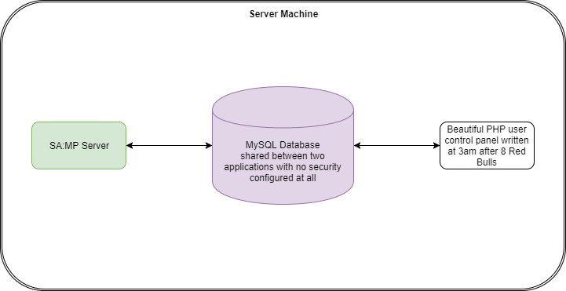

# User Control Panel Example

As an example of where Redis can be used, this document will go through the basic steps to build a server with a user control panel!

This is not a comprehensive example with code and assumes some knowledge of modern webapp design.

## Part 1: The Old Way

First, I'll lay out the *"traditional"* SA:MP way of doing things - this means we pretend it's 2005, no one has figured out microservices and PHP+MySQL is all the rage!



Here we have our beautiful bolognese of PHP hosting a User Control Panel.

The site is very static. The only real way to send an "event" (such as a faction headquarters being under attack) to the web frontend without placing some kind of marker in the database and having the PHP app poll for that marker every minute or so. Yes. I have seen apps that do this. Don't do this.

## Part 2: Upgrading

Okay, so we realise its 2017, lets abandon PHP, uninstall Apache HTTP Server forever, say a prayer for our decaying software friends and get modern.


So, we've now got a shiny new ReactJS/VueJS/Angular/Whatever frontend panel which communicates with a backend server via a WebSocket.

The beautiful thing about WebSockets is they aren't *one way* like our old PHP app which just *asks the server if there's any new data*.

What a WebSocket does is hook up your browser to a server application with a constantly open connection. Instead of the app constantly asking for new data it just sits there and waits for the server to push new data!

## Part 3: What have we gained?

Right, so lets go back to the example:

> The only real way to send an "event" (such as a faction headquarters being under attack) to the web frontend without placing some kind of marker in the database and having the PHP app poll for that marker every minute or so.

With this new system, the server can simply send a message down a *"channel"* which is *consumed* by the *Backend server* and then treated like any other AJAX/WebSockets event.

```c
public OnHqUnderAttack(factionID, attackerFactionID) {
    Redis_SendMessage(gRedis, "faction.notifications.under_attack", sprintf("%d %d", factionID, attackerFactionID))
}
```

This line of code will perform a Redis `LPUSH` [(list-push)](https://redis.io/commands/lpush) instruction, which basically pushes the string onto a list ready for some other app to suck it up and do something with it (which happens on a separate thread I should add, meaning no blocking IO affects the SA:MP server!)

## Part 4: Outside of Pawn-land

Now our event is travelling down a very well lubricated pipe at breakneck speed.

If our backend is written in NodeJS, all we have to do is consume the message via the Redis instruction `BLPOP` [(blocking-list-pop)](https://redis.io/commands/blpop)

```js
client.blpop("OnPlayerText", 0, (err, res) => {
    if (err != "") {
        console.log("ERROR: " + err)
    } else {
        data = res.split(" ")
        factionID = parseInt(data[0])
        attackingFactionID = parseInt(data[1])

        // do a database lookup to grab the faction names
        // send a websocket message to any connected browsers who are part of the faction
        // browser notifies the user so they can log in and join the fun
    }
})
```

## Part 5: In Reverse

This can also happen in reverse. Say a user wanted to click a button on the website that would charge them $50 to explode every enemy faction member.

Once you've dealt with all the PayPal API nonsense, it's as easy as binding a callback in Pawn to a *"channel"* via the Redis plugin:

```c
main() {
    Redis_BindMessage(gRedis, "faction.notifications.explode", "OnUserPurchaseExplosion")
}

public OnUserPurchaseExplosion(data[]) {
    new factionID = strval(data); // 'data' contains the user's faction ID
    ExplodeAllOtherFactions(factionID);
}
```

When the user clicks the button, the backend server would look up the user's faction ID, bundle that into a string and perform a Redis `LPUSH` onto the key `faction.notifications.explode` which the Redis plugin would grab and automatically call the callback associated with that name and pass along the faction ID as a string into the `data` parameter.

## Conclusion

This was a very short introduction to what the Redis plugin can do but hopefully it has sparked some creativity!
